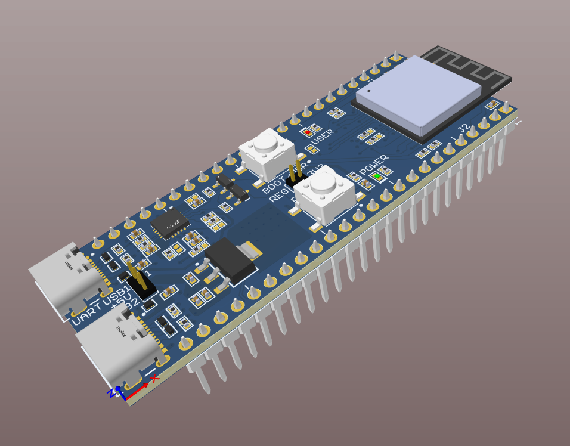

# Custom ESP32-S3 Development Board
**EDA Tool:** Altium Designer

## Project Overview
A custom 4-layer development board based on the ESP32-S3 Mini. 

## Key Features
* **MCU:** ESP32-S3 Mini (Dual-core XTensa LX7, 240 MHz)
* **Power:** 5V USB-C input with 3.3V/800mA LDO regulation.
* **Connectivity:** Native USB-C JTAG/Serial debugging + UART Bridge.
* **PCB Stackup:** 4-Layer (Sig / Gnd / Pwr / Sig) 

## Design View
Output Files available in the (Project Outputs for ESP32 With USB C/Sent To Production/Gerber.zip) folder.

## Fabrication
* Manufactured by JLCPCB.
* Design Rules: 6mil trace / 6mil space.
* Via Sizes: 0.3mm hole / 0.6mm pad.
